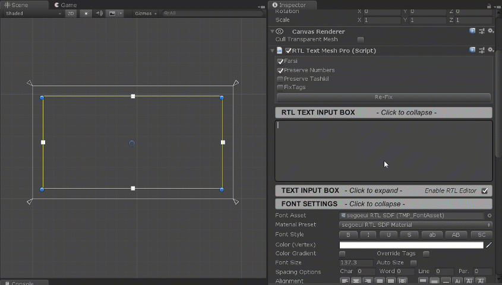
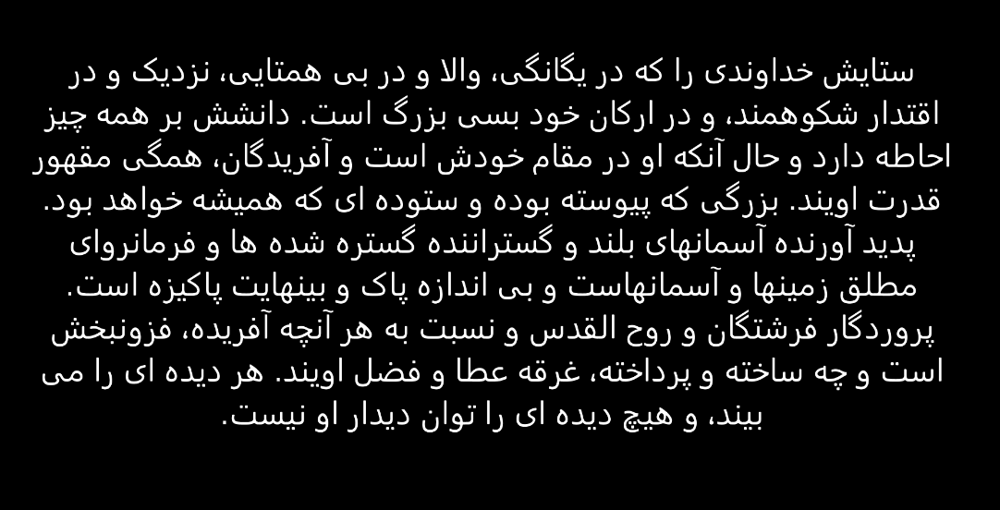
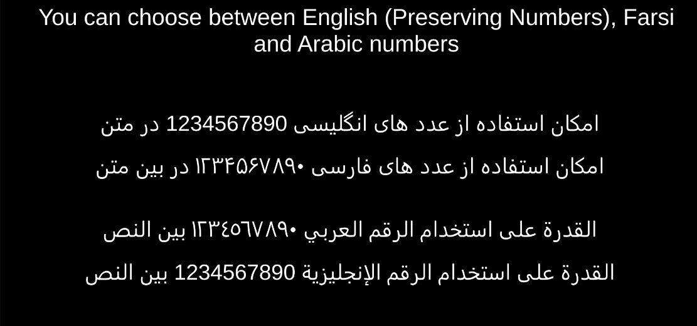

# RTL Text Mesh Pro
This plugin adds Right-to-left language support to "Text Mesh Pro" Unity plugin.  
This project used [ArabicSupprt](https://www.assetstore.unity3d.com/en/#!/content/2674) for Unity Asset. [ArabicSupprt for Unity now on Github.](https://github.com/Konash/arabic-support-unity)

# Features
### Realtime RTL Text
You don't need to convert, copy and paste texts. Start writing and texts will be converted right away.  
  

### Rich Text
All `Text Mesh Pro`'s tags are available in `RTL Text Mesh Pro`
  

### RTL InputField (See [known issues](#known-issues))
Realtime InputField is supported.  
  

### Multiline
Yes, This plugin has no problem with multiline RTL texts.
  

### AutoSize
Auto Font Size is fully supported.  
  

### English, Farsi and Arabic digits are supported
  

### Arabic Tashkeel
Arabic tashkeel are supported. Also you can turn them off or on for every `RTL Text Mesh Pro` object.
  

# How To Use
* Import latest unitypcakage to your project.
* Open one of the range files in `Assets/RTLTMPro/Ranges/` folder using your favorite text editor.
  * RTL Letters are in `LetterRanges.txt` file
  * English, Arabic and Farsi numbers are in `NumberRanges.txt` file
  * Arabic tashil are in `TashkilRanges.txt` file.
* Make sure you have copied ranges that you want to use
* Open `Window/TextMeshPro/Font Asset Creator` window.
* Assign your font in `Font Source` field (Your font must support RTL characters)
* Set `Character Set` to `Unicode Range`
* Paste copied ranges inside  `Character Sequence (Hex)`
* Press `Generate Font Atlas` button and wait for it to generate the atlas file.
* Press `Save TextMeshPro Font Asset` and save the asset.
* Use `GameObject/UI/* - RTLTMP` menu to create RTL UI elements. (Alternatively you can replace `Text Mesh Pro UGUI` components with `RTL Text Mesh Pro`)
* Assign your font asset `Font Asset` property in `RTL Text Mesh Pro` component 
* Enter text in `RTL TEXT INPUT BOX` secion.
  
## Usage Description
### Farsi
When checked, English numbers will be converted to Farsi numbers.
When unchecked, English numbers will be converted to Arabic numbers.
### Preserve Numbers
When checked numbers will not be converted.
### Preserve Tashkeel
When checked Arabic tashkeel will be shown in final text.
### Fix Tags
When checked, RTL Text Mesh Pro will try to fix rich text tags.

# Known Issues
* Multiline has issues with English text.
* InputField (and anything that was designed to work with TextMeshProUGUI script) will not work unless you do these steps:
  * Open `TMP_Text.cs` from TextMeshPro source code
  * add virtual keyword to text property.  
  
  * Open `RTLTextMeshPro.cs` and uncomment the top line where it says `//#define RTL_OVERRIDE`
  * Now you can use InputFields (and Dropdowns in future)
  
# Contribution
All contributions are welcomed. Just make sure you follow the project's code style.  

